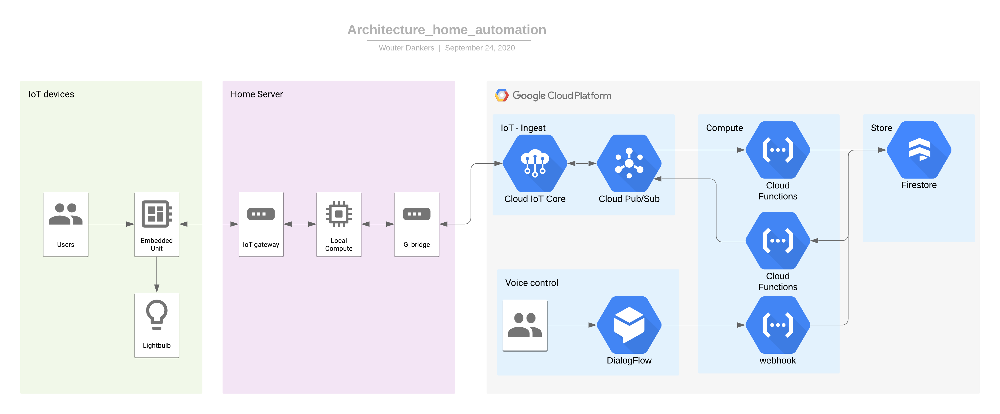

# Home Automation framework
Handles all the communication between my IoT units. It also acts as the link between GCP and my home appliances. 
All IoT units needs to go through the gateway to access the internet. There is one MQTT IoT gateway handling IoT 
traffic. In the future more IoT gateways will be added to handle addition communication protocols
An addition MQTT gateway is present handling traffic going to and from GPC. 

## Architecture

Architectural design made via  [Lucidchart](https://app.lucidchart.com/documents/edit/2025f710-b9e7-49ac-844c-e21cea54473a/0_0)

## Protocols
The Home Server has two MQTT instances, one that forwards messages from Device Gateway to the GCP IoT core and vice 
versa. And One that forwards messages from the IoT devices to and from the G-bridge.

### G-bridge MQTT configuration
Google's IoT core MQTT broker has 4 predefined topics. 
* **Configuration:** Sent from the cloud to the device, up to one message per second. Configuration messages are guaranteed
 to be delivered to the device.
* **Commands:** Send up to 100 messages per second from the cloud to the device. Commands are only delivered if the device
 is online.
* **State:** Sent from the device to the cloud, up to one message per second. State updates are delivered to active Pub/Sub
 subscribers and recent updates are persisted inside Cloud IoT Core.
* **Telemetry:** Send up to 100 messages per second from the device to the cloud. Telemetry events are only delivered to
 active Pub/Sub subscribers.


|               | Info                  |
| ------------- |:---------------------:|
| MQTT broker   | Cloud IoT core        |
| MQTT address  | mqtt.googleapis.com   |
| MQTT port     | 8883                  |
| Security      | RS256                 |

#### Topics
**Configuration**
```
/devices/{device-id}/config
```
**Commands**
```
/devices/{device-id}/commands
```
**State**
```
/devices/{device-id}/state
```
**Telemetry**
```
/devices/{device-id}/events
```

**Message content**
The messages contain a JSON string with explenatory key value pairs. For example, in the case of of a light switch 
updating its status to the cloud. It could send the following message on the topic 
``` /devices/lightswitch-001/state ```.
```
{"light_state": 1}
```